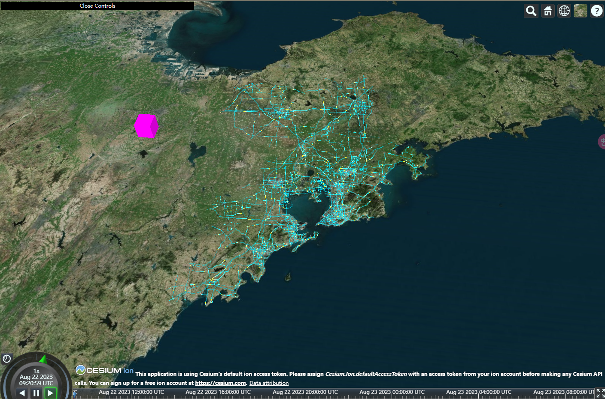

# Cesium.js 中如何自定义 MaterialProperty？

> 本文描述了如何在 Cesium.js 自定义一个 MaterialProperty，并展示效果。
>
> - [查看地址](https://cesium-road-image-flow-material.vercel.app/)
> - [仓库地址](https://github.com/WaterSeeding/CesiumRoadImageFlowMaterial)


<br />

## 介绍

在 Cesium.js 中，MaterialProperty（材质属性）是用于定义材质在时间和空间上变化的动态属性。
它提供了一种机制，可以根据时间、位置、实时数据等动态因素来控制材质的外观效果。

MaterialProperty 是一种抽象基类，它定义了一组通用的方法和属性，用于表示材质属性的变化。
它有多个子类，每个子类都代表不同类型的材质属性，例如颜色属性、纹理属性、透明度属性等。

常见的 MaterialProperty 子类:

1. ColorMaterialProperty: 用于定义材质的颜色属性，可以实现颜色随时间或其他因素的渐变效果
2. ImageMaterialProperty: 用于定义材质的纹理属性，可以根据时间或其他因素切换不同的纹理贴图效果
3. CompositeMaterialProperty: 用于组合多个 MaterialProperty，以实现复杂的材质效果
4. CallbackMaterialProperty: 允许通过回调函数动态计算材质的属性值，以实现自定义的动态效果

<br />

### Material 和 MaterialProperty 的区别

> 在介绍 MaterialProperty 之前，结合和 Material 一起讨论

在 Cesium.js 中，MaterialProperty（材质属性）是用于定义材质在时间和空间上变化的动态属性。

| 变量名称         | 描述                                                                                                   |
| ---------------- | ------------------------------------------------------------------------------------------------------ |
| Material         | Material 是一种静态定义的材质类型: <br> 用于设置几何体的外观效果（适用于 Cesium.Primitive）            |
| MaterialProperty | MaterialProperty 是一种动态的属性: <br> 用于定义材质随时间和其他实时变化的效果（适用于 Cesium.Entity） |

<br />

## 要自定义 MaterialProperty，先要清楚 MaterialProperty 结构

### ColorMaterialProperty

清楚 MaterialProperty 结构，可以从 ColorMaterialProperty 源码下手

1. 创建一个 ColorMaterialProperty 函数

```tsx
function ColorMaterialProperty(color) {
  this._definitionChanged = new Cesium.Event();
  this._color = undefined;
  this._colorSubscription = undefined;

  this.color = color;
}
```

2. 通过`Object.defineProperties`扩展 ColorMaterialProperty 函数，设置 isConstant、definitionChanged 通用属性和 color 属性

> 对应文档的操作：
> isConstant 通过该属性指定是否恒定
> definitionChanged 获取每当此属性的定义更改时引发的事件
> color 获取或设置`color`属性

```tsx
Object.defineProperties(ColorMaterialProperty.prototype, {
  isConstant: {
    get: function () {
      return Cesium.Property.isConstant(this._color);
    },
  },

  definitionChanged: {
    get: function () {
      return this._definitionChanged;
    },
  },

  color: Cesium.createPropertyDescriptor("color"),
});
```

3. 设置`ColorMaterialProperty`函数原型链上的方法:

> 对应文档的操作：
> equals 将此属性与提供的属性进行比较并返回如果相等，则为 true ，否则为 false
> getType 在提供的时间点获取 Material 类型
> color 在提供的时间点获取属性的值

```tsx
ColorMaterialProperty.prototype.getType = function (time) {
  return "Color";
};

ColorMaterialProperty.prototype.getValue = function (time, result) {
  if (!Cesium.defined(result)) {
    result = {};
  }
  result.color = Cesium.Property.getValueOrClonedDefault(
    this._color,
    time,
    Cesium.Color.WHITE,
    result.color
  );
  return result;
};

ColorMaterialProperty.prototype.equals = function (other) {
  return (
    this === other ||
    (other instanceof ColorMaterialProperty &&
      Cesium.Property.equals(this._color, other._color))
  );
};
```

4. 将`ColorMaterialProperty`添加到 `Cesium.Material._materialCache` 中，`addMaterial`函数中的第二个参数就是`Material.option`内容

```tsx
Cesium.Material._materialCache.addMaterial("Color", {
  fabric: {
    type: "Color",
    uniforms: {
      color: new Cesium.Color(1.0, 0.0, 0.0, 0.5),
    },
    // components: {
    //   diffuse: "color.rgb",
    //   alpha: "color.a",
    // },
    source: `
      czm_material czm_getMaterial(czm_materialInput materialInput) {
        czm_material material = czm_getDefaultMaterial(materialInput);
        material.alpha = color.a;
        material.diffuse = color.rgb;
        return material;
      }
    `,
  },
  translucent: function (material) {
    return material.uniforms.color.alpha < 1.0;
  },
});
```

<br />

### 自定义 RoadImageFlowMaterialProperty 材质

1. 创建一个 RoadImageFlowMaterialProperty 类

- 设置 isConstant、definitionChanged 通用属性和 duration 属性（可以赋值）、image 属性（固定值）
- 设置方法 getType、getValue、equals

```tsx
class RoadImageFlowMaterialProperty {
  _definitionChanged: Cesium.Event;
  _time: DOMHighResTimeStamp;
  image: string;
  duration: number;
  constructor(options: { image: string; duration: number }) {
    Object.defineProperties(this, {
      isConstant: {
        get: function () {
          return false;
        },
      },
      definitionChanged: {
        get: function () {
          return this._definitionChanged;
        },
      },
      duration: createPropertyDescriptor("duration"),
    });
    this._definitionChanged = new Cesium.Event();
    this._time = performance.now();
    this.image = options.image;
    this.duration = options.duration;
  }

  getType() {
    return "RoadImageFlowMaterialProperty";
  }

  getValue(time: Cesium.JulianDate, result: any) {
    if (!Cesium.defined(result)) {
      result = {};
    }
    result.image = this.image;
    result.time =
      ((performance.now() - this._time) % this.duration) / this.duration;
    return result;
  }

  equals(other: RoadImageFlowMaterialProperty) {
    return (
      this === other ||
      (other instanceof RoadImageFlowMaterialProperty &&
        this.duration === other.duration)
    );
  }
}
```

2. 将`RoadImageFlowMaterialProperty`添加到 `Cesium.Material._materialCache` 中，`addMaterial`函数中的第二个参数就是`Material.option`内容：其中`fabric.uniforms`对象作为`GLSL`的 uniforms 常量值，来绘制 shader 效果。

```tsx
const RoadImageFlowMaterialSource = `
  czm_material czm_getMaterial(czm_materialInput materialInput) {
    czm_material material = czm_getDefaultMaterial(materialInput);
    vec2 st = materialInput.st;
    vec4 colorImage = texture(image, vec2(fract(st.s - time), st.t));
    material.alpha = colorImage.a;
    material.diffuse = colorImage.rgb * 1.5 ;
    return material;
  }
`;

Cesium.Material._materialCache.addMaterial("RoadImageFlowMaterialProperty", {
  fabric: {
    type: "RoadImageFlowMaterialProperty",
    uniforms: {
      image: "",
      time: 0,
    },
    source: RoadImageFlowMaterialSource,
  },
  translucent: function () {
    return true;
  },
});
```

在 RoadImageFlowMaterialSource 中， material.diffuse 入射光。color 这个变量，来源于之前 fabric 里面 uniforms 的值。

```tsx
material.diffuse = colorImage.rgb * 1.5;
```

在这里，控制的效果是这个颜色的亮度，把 1.5 改成 0.5 它会明显变得更暗。如果把 1.5 改成 3 或者 6，明显可以看到颜色更亮了。



<br />

## 相关资料

- [Cesium](https://cesium.com/)
- [Cesium Documentation](https://cesium.com/docs/)
- [https://github.com/CesiumGS/cesium/wiki/Fabric](https://github.com/CesiumGS/cesium/wiki/Fabric)
- [Cesium.js 中如何自定义 Material 材质效果？](https://juejin.cn/post/7269726256327835705)
